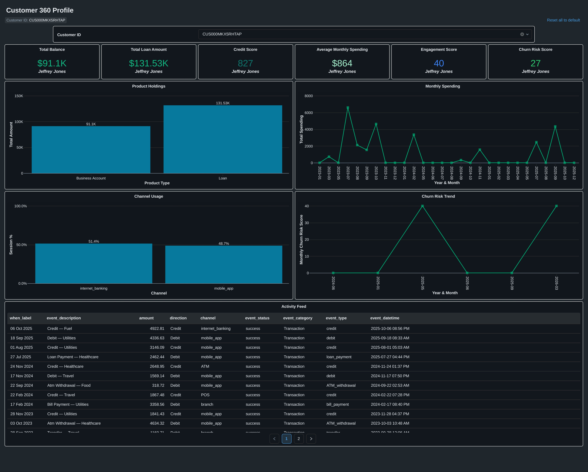

# Customer 360 — Databricks Data Engineering Project

A complete Customer 360 banking data pipeline built on 
Databricks using the Medallion Architecture.

## What this project does
Builds a single, unified 360° view of every bank customer by 
combining data from 11 source systems — accounts, loans, 
cards, transactions, digital activity, CRM interactions and 
marketing notifications.

## Architecture
- Source CSVs (11 files, 1.17M rows)
- ↓
- Bronze Layer — Raw Delta tables (exact copy, audit columns)
- ↓
- Silver Layer — Cleaned, typed, ID-reconciled (10 tables + 6 maps)
- ↓
- Gold Layer — Pre-aggregated business metrics (6 tables)
- ↓
- Databricks AI/BI Dashboard — Customer 360 Profile

## Tech stack
- Platform : Databricks (Unity Catalog, Delta Lake)
- Language : SQL + PySpark
- Storage  : Delta tables via Unity Catalog Volumes
- Dashboard: Databricks AI/BI Dashboard

## Datasets
| Layer  | Tables | Total rows     |
|--------|--------|----------------|
| Bronze | 11     | 1,170,500      |
| Silver | 11     | 1,170,500      |
| Gold   | 6      | Pre-aggregated |

## Notebooks
| Notebook | Purpose |
|----------|---------|
| 00_Project_Architecture | Visual pipeline + live row counts |
| Bronze.py | Raw ingestion from CSV to Delta |
| Silver.py | Data quality + ID reconciliation |
| Gold.py | Business aggregations + score formulas |

## Dashboard panels
- Customer header with tags (High Value, Digital-first, Low churn risk)
- KPI cards: Total balance, Loan exposure, Credit score, Monthly spend
- Engagement score (0–100) and Churn risk score (0–100)
- Product holdings bar chart
- Monthly spending trend (line chart)
- Channel usage breakdown (bar chart)
- Churn risk trend over time (line chart)
- Activity feed (merged transactions + interactions)

## Dashboard Preview

**Customer 360 Profile**

**Customer Segmentation**

### What the dashboard shows
- **Top row**: Customer identity + 6 KPI cards (balance, loan, credit score, spending, engagement, churn risk)
- **Middle row**: Product holdings bar chart + Monthly spending line chart
- **Bottom row**: Channel usage bar chart + Churn risk trend line chart
- **Activity feed**: Complete transaction and interaction history
- **Filter**: Switch any customer ID to see their complete 360° profile instantly
